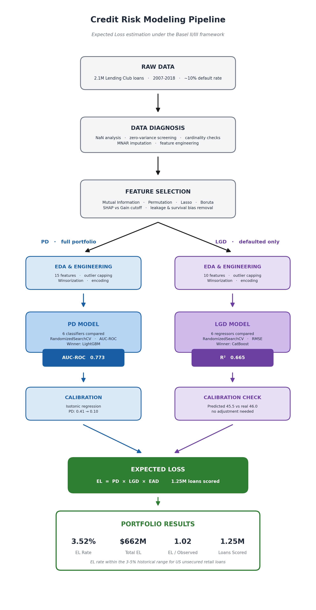
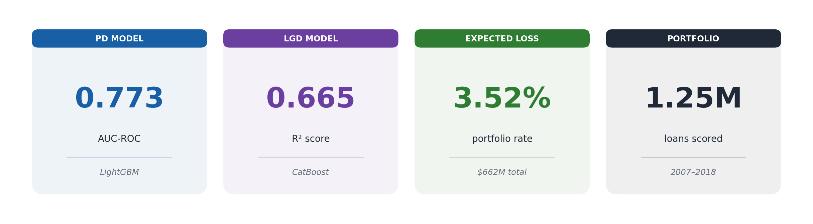
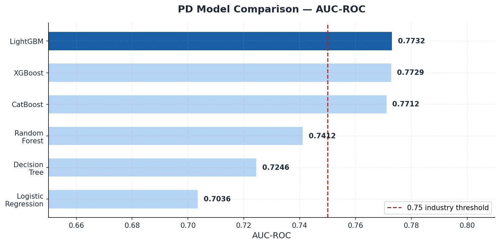
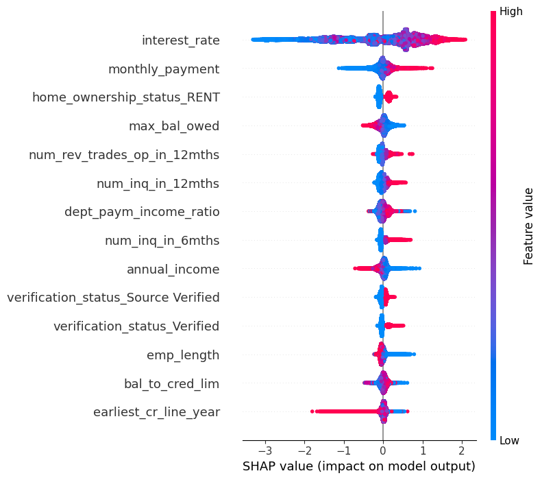
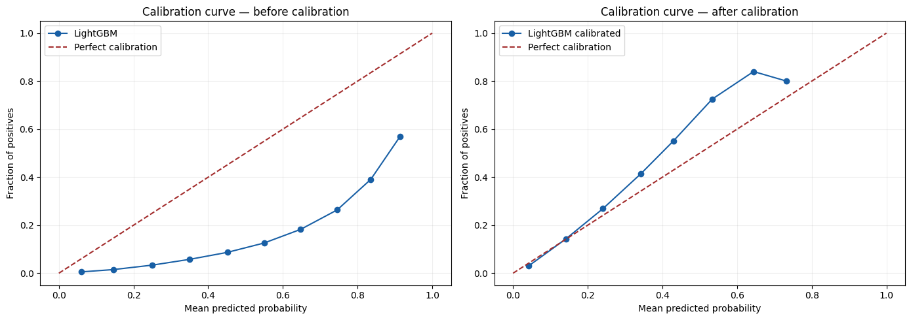
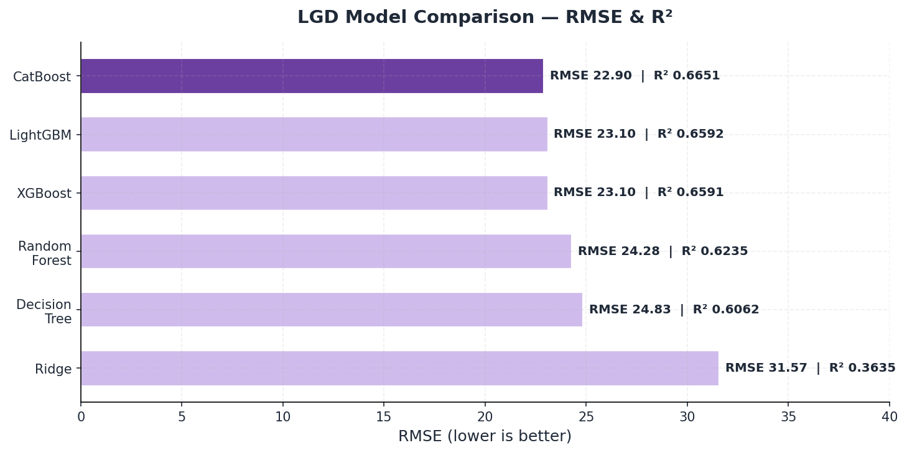
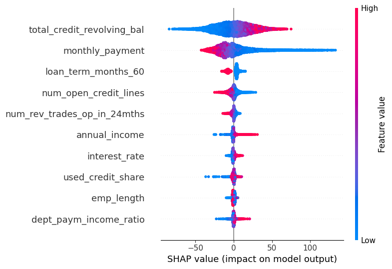
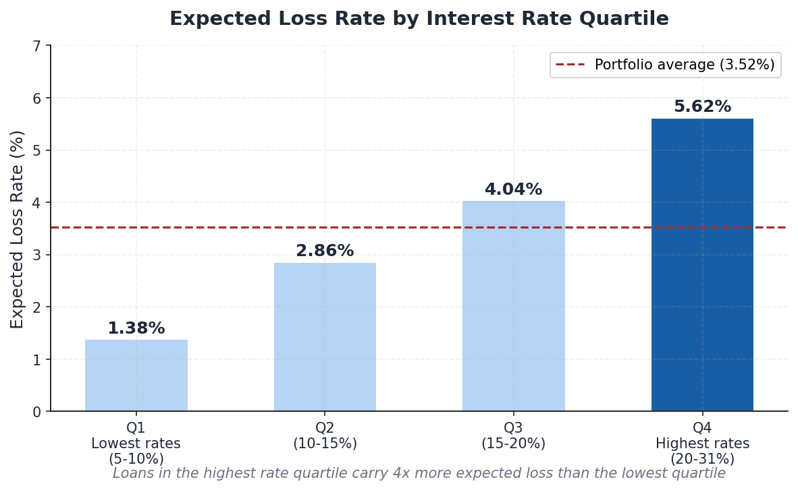

# A Deep Dive into Expected Loss through Credit Scoring Industry-Standard Machine Learning under Basel II/III

**A full end-to-end credit risk pipeline built on 2.1 million Lending Club loans, producing calibrated Probability of Default, Loss Given Default, and Expected Loss estimates for an entire loan portfolio.**


---

## What this project does

Banks and lenders need to know how much money they stand to lose from a loan portfolio before they buy it. This project builds the full framework to answer that question, following the same methodology used in real banking environments under the Basel II/III regulatory framework.

The pipeline takes raw loan data and outputs, for every single loan in the portfolio, three numbers: the probability that the borrower will default, the percentage of the loan value that would be lost if they do, and the expected monetary loss combining both. Multiply those three numbers together and you have the Expected Loss of the portfolio.



---

## Results at a glance



The portfolio expected loss rate of 3.52% falls exactly within the historical 3-5% range for US unsecured personal loans, confirming that the models produce economically sound estimates, not just statistically optimized ones.

---

## The two models

### Probability of Default (PD)

Six classification models were trained and compared. The winner was LightGBM with an AUC-ROC of 0.773, well into the "very good" range for retail credit risk without behavioral variables.



One thing worth highlighting: the gap between logistic regression (0.704) and LightGBM (0.773) is exactly the kind of result that fuels the ongoing debate in the industry between interpretability and performance. Logistic regression is the regulatory standard in Basel IRB because every coefficient is auditable. Gradient boosting is better at capturing the complex non-linear relationships in borrower data. This project trains both and documents the trade-off.

To understand what actually drives the model's predictions, SHAP values were computed on the final model. The plot below shows how each feature pushes a borrower's predicted default probability up or down. Interest rate, monthly payment and home ownership status come out as the strongest drivers, which matches the economic intuition: a borrower paying a high rate, already stretched on debt, and using most of their available credit is exactly the profile a risk analyst would flag.



A model that performs well but cannot be explained is a hard sell in a regulated environment. SHAP makes every prediction auditable, which is what allows a gradient boosting model to even be considered alongside the regulatory-standard logistic regression.

### Probability calibration

A good risk score is not enough on its own. For Expected Loss to be meaningful, a predicted probability of 0.30 has to actually mean a 30% chance of default. The raw LightGBM output failed this test badly: class imbalance handling inflated the average predicted probability to 0.41, four times the real default rate of 0.10.

Isotonic regression calibration fixed this without touching the model's ability to rank borrowers by risk. The result lines up almost perfectly with reality:

> After calibration: mean PD = **0.1017**, observed default rate = **0.1017**



The curve on the left shows the raw model drifting away from the diagonal that represents perfect calibration. On the right, after calibration, the predictions track that diagonal closely across the full range of scores. This is the difference between a model that ranks risk well and one whose numbers can actually be trusted in a loss calculation.

### Loss Given Default (LGD)

Six regression models were trained on the ~128k defaulted loans only. CatBoost came out on top with an R² of 0.665 and RMSE of 22.9 percentage points, well above the 0.15-0.40 R² typical of production LGD models trained on real recovery data.



The LGD model is then applied to the entire portfolio (including non-defaulted loans) to estimate what would be lost if each loan were to default. This is standard practice in Basel IRB capital calculations.

As with the PD model, SHAP values reveal what drives the loss predictions. The total revolving balance and the monthly payment dominate, which makes sense: both are direct measures of how much money is on the line when a borrower stops paying. The larger the outstanding exposure, the more there is to lose.



Reassuringly, the model needs no calibration adjustment. The average predicted loss on defaulted loans (45.5%) lands almost exactly on the observed average (46.0%), a natural consequence of regression not suffering from the class imbalance problem that distorted the PD probabilities.

---

## Expected Loss validation

The real test of a credit risk model is not just whether the individual components perform well in isolation, but whether the combined output makes economic sense. Three checks were run:

**Check 1:** Total EL (662M) is 1.68% above the observed loss on defaulted loans (651M). The small surplus represents the expected losses from currently performing loans with non-zero default probability. This is exactly what EL should be.

**Check 2:** EL rate by loan term: 36-month loans at 3.42%, 60-month loans at 3.68%. Longer loans carry more risk. Correct.

**Check 3:** EL rate by interest rate quartile. This is where the model really shows its discrimination power:



The highest-rate borrowers carry four times the expected loss of the lowest-rate borrowers. The interest rate that Lending Club assigned at origination turns out to be a strong signal of true credit risk, and the model captures that gradient correctly.

---

## What makes this project different from a Kaggle notebook

Most credit risk projects on GitHub train one model, report AUC, and call it done. This project does the full thing:

- **Two independent models** with separate populations, feature sets, and preprocessing pipelines, built the way they would be in a bank
- **Dual feature selection** combining statistical criteria (SHAP importance, mutual information, permutation importance, Lasso, Boruta) with economic domain knowledge
- **Survival bias and leakage detection**: variables like `issue_date_year` and post-default recovery metrics are explicitly excluded with documented justification
- **Inference architecture**: the LGD pipeline is fitted on defaulted loans and applied to the full portfolio, with the reasoning for why this is correct (and its limitations) fully documented
- **Probability calibration**: the PD model outputs are calibrated from a mean of 0.41 down to 0.10 using isotonic regression
- **Economic validation**: the EL output is validated against observed losses and tested for correct segment-level ordering, not just cross-validation metrics
- **12 models compared**: 6 classifiers for PD, 6 regressors for LGD, each tuned with RandomizedSearchCV

---

## Project structure

```
repo/
    original_notebook/
        CreditScoring_ExpectedLossCalculation.ipynb   # full exploratory notebook with all analysis
    production_notebooks/
        01_data_diagnosis.ipynb
        02_feature_selection.ipynb
        03_eda_pd.ipynb
        04_eda_lgd.ipynb
        05_training_pd.ipynb
        06_training_lgd.ipynb
        07_expected_loss.ipynb
    src/
        pipeline_PD.py
        pipeline_LGD.py
        train_models_PD.py
        train_models_LGD.py
        clean_features_PD.py
        clean_features_LGD.py
        preprocess.py
    docs/
        # 11 markdown documents covering every design decision
    assets/
        # charts and visualizations
    requirements.txt
```

The original notebook contains the full exploratory analysis with all intermediate outputs, comments, and visualizations. The production notebooks are a clean, modular reorganization designed for independent execution. A full technical README for the production notebooks lives in `production_notebooks/TECHNICAL_README.md`.

---

## How to run it

```bash
git clone https://github.com/yourusername/credit-risk-expected-loss
cd credit-risk-expected-loss
pip install -r requirements.txt
```

Then run the production notebooks in order (01 through 07), or open the original notebook for the full analysis.

Data from [Lending Club Loan Data on Kaggle](https://www.kaggle.com/). Place `target.csv` and `X.csv` in `data/raw/`.

---

## Limitations

This project is a portfolio implementation, not a production banking system. The most important limitations to be aware of:

The train/test split is random rather than chronological, which means the reported metrics are optimistic compared to a proper out-of-time validation. The LGD target is a proxy (`max_bal_owed / funded_amnt`) rather than real net recovery data. The probability calibration is fitted on the test set due to the absence of a dedicated calibration split. And the models do not incorporate the behavioral variables (monthly payment history, balance evolution) that production credit risk models rely on heavily. All of these are documented in detail in the `docs/` folder.

---

## Tech stack

Python 3.13.2, scikit-learn, XGBoost, LightGBM, CatBoost, SHAP, pandas, NumPy, matplotlib
